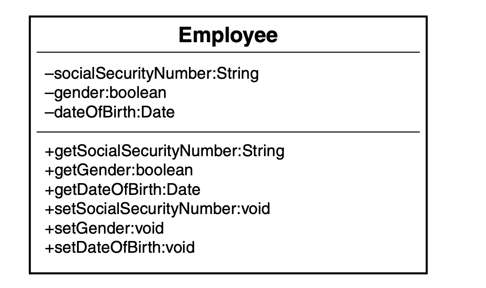
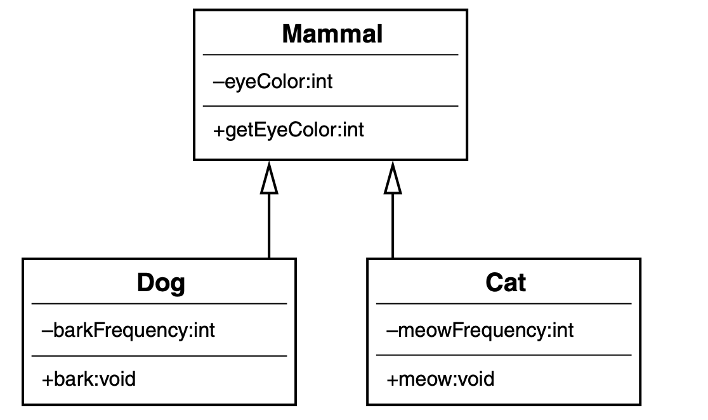

## The Object Oriented thought Process 

### Chapter 1 - Introduction to Object-Oriented Concepts

Object: An entity that has both attributes and behaviors.
- Person is an object, And it has attributes like Age, Color, etc. Walking, Eating, Talking are the behaviors of the Person. Data stored within the object also represents the state of the object.
- In procedural programming, data is often global, the access to data is uncontrolled and unpredictable. Whereas, In objects the data and behaviours are packaged into a single entity.
- In a properly designed system, there is nothing like global data.
- Direct access and modification of data is not preferred. Getters and Setter methods are used to access and manipulate the object data. This promotes the concept of data hiding.
- Class - It's the blueprint of an object. When you try to make an object, your class only defines how the object would be created. The class defines all the attributes and behaviours of the objects.

- Employee is the class, and dateOfBirth, gender etc. are the attributes and getGender, etc. are the behaviours of Employee Class.
``` 
class Person:
    def __init__(self):
        self.name = None
        self.age = None
    
    def get_name(self):
        return self.name
    
    def get_age(self):
        return self.name
        
    def set_name(self,name):
        self.name = name
        
    def set_age(self,age):
        self.age = age

ob = Person()
print(ob.get_age()) # None
print(ob.get_name()) # None
ob.set_name("John")
ob.set_age(24)
print(ob.get_name()) # John
print(ob.get_age()) # 24
```
- Encapsulation: Wrapping the data and behaviour into a single unit. Hiding the internal things of a class from the outside world. 
- In a good OO design, an object need not to expose all its attributes and behaviours. 
- Interfaces: Interfaces are the contracs that a class implements. When a class implements an interface, it guarantees that it will have all the methods defined in the Interface. This allows users of that class to know what methods they can call on instances of that class without needing to understand the details of how the class works internally.
- Inheritance: Enables a class to inherit the attributes and behaviours of another class (Is-a relationship).

- Superclasses: Parent classes of a class.
- Subclasses: Child classes of a class.
- Polymorphism: Polymorphism is the ability of a method or an object to take on multiple forms. In OOP, polymorphism allows an operation to exhibit different behaviour in different instances. Like ```len``` method in python, you can use it for getting the length of a string as well as a list.
- Composition: Composition means that an object is built from other objects(Has-A Relationship).